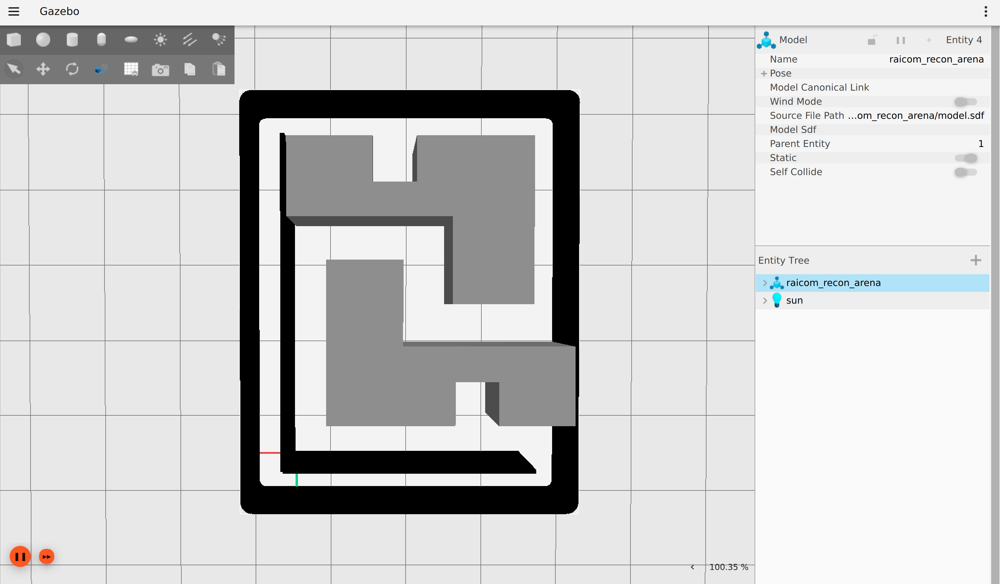

# RAICOM Intelligent Reconnaissance — Simulation Engineering Project Documentation

---

## 1. Project Overview



This project provides a simulation environment for the **RAICOM Intelligent Reconnaissance competition track**.

The current project inherits a robot model that is nominally described as an omnidirectional chassis but is actually based on an **Ackermann steering chassis**. The planned modification is to convert it into a true **Mecanum omnidirectional chassis** to support navigation through a narrow 5 m × 4 m competition track with a minimum corridor width of 0.50 m.

**Core Pipeline:**

```text
Gazebo World → ros_gz_bridge → ROS 2 Topics
    ↓
mecanum_robot_sim (Collision Safety / Joint State Republisher)
    ↓
Navigation / SLAM (Nav2 / SLAM Toolbox)
    ↓
cmd_vel → mecanum_drive_controller → Wheel Velocities → Gazebo
```

---

## 2. Host Machine Environment

| Item         | Value                                   |
| ------------ | --------------------------------------- |
| OS           | Ubuntu 24.04.3 LTS (Noble)              |
| Architecture | x86_64                                  |
| Memory       | 13 GB                                   |
| GPU          | RTX 3060 Laptop 6 GB, Driver 570.211.01 |
| CUDA         | 12.8                                    |
| DISPLAY      | :1 X11                                  |
| Host ROS 2   | None (ROS 2 is only used inside Docker) |

```bash
# No ros2 command on the host
$ ros2
bash: ros2: command not found
```

---

## 3. Docker Images

| Image                        | TAG    | Size    | Purpose                 |
| ---------------------------- | ------ | ------- | ----------------------- |
| `raicom-humble-x11:compiled` | —      | 5.76 GB | Main simulation image   |
| `ros:humble`                 | latest | 1.15 GB | Base ROS 2 Humble image |
| `kuavo_raicom_img:v1.0`      | —      | 18.9 GB | Robot simulation        |

**Main image includes:**

* ROS 2 Humble
* Ignition Gazebo 6 (Fortress)
* `ros-humble-ros-gz-sim` / `ros-humble-ros-gz-bridge`
* CycloneDDS RMW
* `fonts-noto-cjk` (CJK fonts)
* Does not contain the current workspace packages (built separately)

```bash
# Check installed images
docker images | grep raicom-humble-x11
```

---

## 4. Project Directory Structure

```text
/home/shigure/archive/raicom/
├── run_humble_docker.sh          # One-click build / simulation / navigation / SLAM script ★
├── tmp.txt                       # Track parameters / waypoint conversion
├── tag/ tag2/                    # AprilTag related files
├── config/
│   └── board1_tags.yaml
├── scripts/                      # Utility scripts
├── docs/                         # Documentation
├── maps/                         # Legacy maps
│   ├── my_map.yaml
│   └── my_map.pgm
└── ros2_ws/                      # ★ ROS 2 workspace
    ├── build/                    # colcon build artifacts
    ├── install/                  # colcon install artifacts
    ├── log/                      # Build logs
    ├── map01/                    # ★ Current reconnaissance map
    │   ├── compitation.yaml
    │   └── compitation.pgm       # 128 × 152 px, 0.05 m/px
    ├── maps/
    │   ├── smart_pharmacy.yaml   # Legacy pharmacy map
    │   └── smart_pharmacy.pgm    # 78 × 99 px
    └── src/                      # ★ Source code
        ├── keyboard_control/
        ├── mecanum_robot/
        ├── mecanum_robot_sim/
        ├── navigation/
        ├── pharmacy_task/
        ├── pharmacy_vision/
        ├── ruikang_yolo/         # YOLO model (no package.xml)
        └── slam/
```

---

## 5. ROS 2 Package List (7 Packages)

### 5.1 `mecanum_robot`

* **Description:** Automatically generated 4-wheel Mecanum robot package
* **Role:** Static environment / robot model / world resources
* **Key contents:**

  * `worlds/raicom_intelligent_recon.world` — Gazebo world file
  * `models/raicom_recon_arena/` — Competition arena model, including walls and obstacle polygons
  * `models/pharmacy_board1_dynamic/` — Dynamic recognition board
  * `launch/display.launch.py` — RViz URDF visualization
  * `launch/gazebo_map.launch.py` — Launches the arena only (without the robot)
* **Notes:** This is a resource package and does not contain motion control or kinematic logic.

### 5.2 `mecanum_robot_sim`

* **Description:** Gazebo simulation and keyboard teleoperation
* **Role:** Main simulation launch entry point
* **Key contents:**

  * `launch/keyboard_gazebo.launch.py` — ★ Main launch file
  * `urdf/mecanum_robot_sim.urdf` — Robot model
  * `scripts/collision_safety_node.py` — LiDAR collision avoidance
  * `scripts/joint_state_republisher.py` — Joint state republisher
  * `scripts/clock_republisher.py` — Simulation clock republisher
  * `scripts/keyboard_teleop.py` — Keyboard teleoperation

### 5.3 `slam`

* **Description:** SLAM mapping
* **Role:** Online mapping using `slam_toolbox`
* **Key contents:**

  * `launch/slam_gazebo.launch.py` — SLAM launch file, including Gazebo
  * `config/slam_toolbox.yaml` — SLAM parameters
  * `scripts/odom_tf_broadcaster.py` — `odom → base_footprint` TF broadcaster
  * `scripts/scan_frame_republisher.py` — `scan_raw → scan` conversion
  * `scripts/scan_cone_visualizer.py` — Scan cone visualization

### 5.4 `navigation`

* **Description:** Nav2 navigation
* **Role:** Autonomous navigation, route control, and YOLO detection
* **Key contents:**

  * `launch/navigation.launch.py` — Complete Nav2 launch
  * `launch/auto_recon_mission.launch.py` — Autonomous reconnaissance mission
  * `launch/bringup.launch.py` — Nav2 bringup
  * `launch/localization.launch.py` — AMCL localization
  * `launch/rtabmap.launch.py` — RTAB-Map
  * `config/nav2_params.yaml` — Main Nav2 parameters
  * `config/nav2_controller_teb.yaml` — TEB controller configuration
  * `config/nav2_controller_dwb.yaml` — DWB controller configuration
  * `config/recognition_routes.yaml` — Recognition routes / waypoints
  * `scripts/recognition_line_commander.py` — Straight-line route commander
  * `scripts/recognition_route_commander.py` — Nav2 route commander
  * `scripts/yolo_camera_detector.py` — YOLO detection node
* **Notes:**

  * The default map path is hard-coded as `/home/ubuntu/raicom/maps/my_map.yaml`; inside Docker it needs to be changed to `/ws/map01/compitation.yaml`.
  * The default YOLO model path is also `/home/ubuntu/...`.
  * `recognition_routes.yaml` still contains pharmacy/laboratory-area semantics such as A/B/C and laboratory windows.

### 5.5 `pharmacy_task`

* **Description:** Pharmacy task execution
* **Role:** Pharmacy routes / referee bridge (not used in the current reconnaissance track)
* **Key contents:** `scripts/pharmacy_task_node.py`, `scripts/referee_bridge_node.py`

### 5.6 `pharmacy_vision`

* **Description:** Recognition board vision
* **Role:** Board1 / Board2 recognition (not used in the current reconnaissance track)
* **Key contents:** `scripts/board1_recognition_node.py`, `scripts/board2_recognition_node.py`

### 5.7 `keyboard_control`

* **Description:** GUI keyboard teleoperation
* **Role:** Window-focused teleoperation
* **Key contents:** `scripts/gui_keyboard_teleop.py`

---

## 6. Map Files

### 6.1 Current Reconnaissance Map ★

| Item           | `compitation.yaml` / `compitation.pgm`        |
| -------------- | --------------------------------------------- |
| Path           | `/home/shigure/archive/raicom/ros2_ws/map01/` |
| Container Path | `/ws/map01/compitation.yaml`                  |
| PGM Size       | 128 × 152 px                                  |
| Resolution     | 0.05 m/px                                     |
| Coverage       | ~6.4 m × ~7.6 m                               |
| Origin         | `[-3.405656, -1.957087, 0.0]`                 |

```yaml
# compitation.yaml
image: compitation.pgm
resolution: 0.050000
origin: [-3.405656, -1.957087, 0.000000]
negate: 0
occupied_thresh: 0.65
free_thresh: 0.196
```

### 6.2 Legacy Maps (Reference)

| Map                        | PGM Size | Origin               | Purpose                             |
| -------------------------- | -------- | -------------------- | ----------------------------------- |
| `maps/my_map.yaml`         | 102 × 82 | [-0.0611, 0.0137, 0] | Legacy reconnaissance / development |
| `maps/smart_pharmacy.yaml` | 78 × 99  | [-1.96, -2.49, 0]    | Smart pharmacy                      |

---

## 7. Core Launch Files

### 7.1 Simulation Only (Gazebo + Robot)

```text
mecanum_robot_sim keyboard_gazebo.launch.py
```

**Launches:**

1. `generate_recon_arena.py` — Generates the SDF arena from the map image
2. `ign gazebo --force-version 6` — Gazebo server
3. `clock_republisher`
4. `robot_state_publisher` (URDF)
5. `joint_state_republisher`
6. `spawn_mecanum_robot` (2-second delay)
7. `collision_safety_node`
8. `parameter_bridge` (cmd_vel, odom, scan, camera, joint_states, clock)
9. `keyboard_teleop` (optional)

**Parameters:**

| Parameter            | Default                    | Description            |
| -------------------- | -------------------------- | ---------------------- |
| `gui`                | `true`                     | Gazebo GUI             |
| `teleop`             | `true`                     | Keyboard teleoperation |
| `use_sim_time`       | `true`                     | Use simulation time    |
| `world_name`         | `raicom_intelligent_recon` | World name             |
| `spawn_x`            | `0.25`                     | Initial X position     |
| `spawn_y`            | `3.10`                     | Initial Y position     |
| `spawn_yaw`          | `-1.5708`                  | Initial orientation    |
| `ROS_DOMAIN_ID`      | `42`                       | DDS domain isolation   |
| `RMW_IMPLEMENTATION` | `rmw_cyclonedds_cpp`       | DDS middleware         |

### 7.2 SLAM Mapping

```text
slam slam_gazebo.launch.py
```

Internally launches `keyboard_gazebo.launch.py` + odometry TF + scan frame conversion + `slam_toolbox` + `rviz2`.

### 7.3 Nav2 Navigation

```text
navigation navigation.launch.py
```

Internally launches `keyboard_gazebo.launch.py` + odometry TF + `map_to_odom` TF + Nav2 bringup + route commander + YOLO + `rviz2`.

### 7.4 Autonomous Reconnaissance Mission

```text
navigation auto_recon_mission.launch.py
```

Parameters:

```text
route_ids:=101,102,103
```

Route IDs are comma-separated.

---

## 8. Collision Safety Node

`collision_safety_node.py` provides LiDAR-based collision avoidance:

```text
cmd_vel_topic: /cmd_vel
cmd_vel_out:   /cmd_vel_safe
scan_topic:    /scan_raw
```

**Key parameters:**

| Parameter                       | Value     | Description                         |
| ------------------------------- | --------- | ----------------------------------- |
| `stop_distance`                 | 0.095 m   | Forward emergency stopping distance |
| `release_distance`              | 0.16 m    | Release distance                    |
| `side_stop_distance`            | 0.10 m    | Lateral stopping distance           |
| `backup_speed`                  | -0.14 m/s | Reverse speed                       |
| `corridor_front_clear_distance` | 0.22 m    | Safe distance in front of the robot |
| `corridor_balance_distance`     | 0.45 m    | Corridor balancing distance         |

**Known issue:** During high-speed Pure Pursuit, `collision_safety` may trigger false positives. Consider setting `use_safety:=false` or tuning the parameters.

---

## 9. Topic / Bridge Topology

```text
┌──────────────────────────────────────────────────┐
│ Gazebo                                           │
│  ┌─ cmd_vel (geometry_msgs/Twist)  ] ROS→Gazebo │
│  ├─ odom   (nav_msgs/Odometry)     [Gazebo→ROS  │
│  ├─ scan_raw (sensor_msgs/LaserScan)[Gazebo→ROS  │
│  ├─ camera (sensor_msgs/Image)     [Gazebo→ROS  │
│  ├─ camera_info                     [Gazebo→ROS  │
│  ├─ joint_states                    [Gazebo→ROS  │
│  └─ clock                           [Gazebo→ROS  │
└──────────────────────────────────────────────────┘
                    ↓ ros_gz_bridge
┌──────────────────────────────────────────────────┐
│ ROS 2                                             │
│  /cmd_vel_safe  ← Bridge remapping               │
│  /odom           ← Bridge                         │
│  /scan_raw       ← Bridge                         │
│  /camera/image_raw ← Bridge remapping             │
│  /joint_states_raw ← Bridge remapping             │
│  /clock_raw      ← Bridge remapping               │
└──────────────────────────────────────────────────┘
                    ↓
┌──────────────────────────────────────────────────┐
│ Application Layer                                 │
│  /cmd_vel → collision_safety → /cmd_vel_safe     │
│  /scan_raw → scan_frame_republisher → /scan      │
│  /joint_states_raw → joint_state_republisher     │
│                    → /joint_states_clean         │
│  /clock_raw → clock_republisher → /clock         │
└──────────────────────────────────────────────────┘
```

---

## 10. One-Click Launch Script

**Path:** `/home/shigure/archive/raicom/run_humble_docker.sh`

```bash
# Build
./run_humble_docker.sh build

# Start simulation (Gazebo + robot)
./run_humble_docker.sh sim

# Start SLAM mapping
./run_humble_docker.sh slam

# Start Nav2 navigation (using compitation.yaml)
./run_humble_docker.sh nav

# Enter container shell
./run_humble_docker.sh shell

# Pass additional arguments
./run_humble_docker.sh sim gui:=true teleop:=false
```

**Environment variable overrides:**

```bash
RAICOM_DOCKER_IMAGE=ros:humble ./run_humble_docker.sh build
RAICOM_CONTAINER=my-sim ./run_humble_docker.sh sim
```

---

## 11. Build

```bash
# Full build inside Docker (≈6 s)
docker run --rm -v /home/shigure/archive/raicom/ros2_ws:/ws -w /ws \
  raicom-humble-x11:compiled \
  bash -c 'source /opt/ros/humble/setup.bash && \
           colcon build --symlink-install --continue-on-error'
```

**Build result:**

```text
Summary: 7 packages finished [6.04s]
  keyboard_control  [0.89s]
  pharmacy_vision   [0.90s]
  pharmacy_task     [0.91s]
  mecanum_robot     [3.54s]
  mecanum_robot_sim [0.70s]
  slam              [0.71s]
  navigation        [0.90s]
```

---

## 12. Algorithms Available in the Docker Image

The `raicom-humble-x11:compiled` image already includes the following Nav2 controllers:

```text
nav2_controller
nav2_dwb_controller                    # DWB omnidirectional controller
nav2_mppi_controller                   # MPPI model predictive controller
nav2_regulated_pure_pursuit_controller # Regulated Pure Pursuit
nav2_rotation_shim_controller
dwb_core / dwb_critics / dwb_plugins
```

**No additional installation is required** — these are components of the official ROS 2 Humble Nav2 distribution.

---

## 13. Current Issues

### 13.1 Chassis Issues (Critical)

* The packages are named `mecanum_robot` / `mecanum_robot_sim`, but the actual chassis is Ackermann-based.
* Remnants of the `AckermannSteering` plugin remain; the conversion is incomplete.
* No actual `mecanum_drive_controller` is currently implemented.
* The `cmd_vel` bridge currently uses `Twist` rather than directly controlling four independent wheel velocities.
* → **A true Mecanum chassis conversion is required** (see Section 14).

### 13.2 Navigation Package Legacy Issues

* Default map path is hard-coded: `/home/ubuntu/raicom/maps/my_map.yaml`
* Default YOLO model path: `/home/ubuntu/raicom/...`
* `recognition_routes.yaml` still contains pharmacy-related semantics such as A/B/C and laboratory windows.
* The semantic meaning of `route_ids` used by `auto_recon_mission` remains unclear.

### 13.3 Map / Coordinate Issues

* `compitation.yaml` origin: `[-3.406, -1.957]` — non-zero origin; pay attention to `map_to_odom` alignment.
* `navigation.launch.py` default spawn position: `x=0.27, y=3.72` — needs to be verified against the `compitation` map boundaries.

### 13.4 No Git Version Control

* `ros2_ws/src` is not currently a Git repository.
* There is no version control, making modification history difficult to track.

---

## 14. Modification Plan (Pending)

### Phase 1: Chassis Conversion

* [ ] Convert the Ackermann chassis to a true Mecanum chassis
* [ ] URDF: Remove steering joints and connect all four wheels directly to `base_link`
* [ ] Add `mecanum_drive_controller` or a custom inverse-kinematics node
* [ ] Replace the Gazebo plugin: `AckermannSteering` → 4 × `JointController`
* [ ] Update `ros_gz_bridge` to add four-wheel velocity bridging

### Phase 2: Competition Track Adaptation

* [ ] Create reconnaissance-specific waypoint files
* [ ] Replace `recognition_routes.yaml` with reconnaissance-specific semantics
* [ ] Change the default map to `/ws/map01/compitation.yaml`
* [ ] Disable unnecessary YOLO detection

### Phase 3: Algorithms

* [ ] Select a controller: DWB or MPPI
* [ ] Tune narrow-corridor parameters (velocity / acceleration / costmap)
* [ ] Implement precise stopping logic for recognition zones

### Phase 4: Visual / Mechanical Modification

* [ ] Reference geometry from open-source robot models
* [ ] Modify the appearance so that it does not resemble any known open-source project
* [ ] Modify the wheel meshes

### Phase 5: Version Control and Delivery

* [ ] Initialize Git
* [ ] Clean `build/`, `install/`, and `log/` before the initial commit
* [ ] Update documentation

---

## 15. GitHub Model Candidates (Previously Investigated)

| Repository                       | Stars | License    | Suitability | Notes                                                                                       |
| -------------------------------- | ----- | ---------- | ----------- | ------------------------------------------------------------------------------------------- |
| `jbyfdikgi/ros2_mecanum_chassis` | 0     | None       | High        | Simple Xacro model with Chinese comments; pure geometric chassis and relatively distinctive |
| `MasdikaAliman/mecanum-ros2`     | 2     | None       | Medium      | Rosmaster X3 style with Mecanum wheel meshes, but visually similar to commercial products   |
| `linorobot/linorobot2`           | 908   | Apache-2.0 | High        | Mature project with a permissive license, but very well known                               |
| `neobotix/neo_mpc_planner2`      | 63    | MIT        | Medium      | Omnidirectional MPC algorithm rather than a robot model; relatively heavy dependencies      |

---

## 16. Common Commands

```bash
# Docker container management
docker ps -a | grep raicom
docker rm -f raicom-sim

# Execute commands inside the container
docker exec -e ROS_DOMAIN_ID=42 raicom-sim bash -c \
  'source /opt/ros/humble/setup.bash && source /ws/install/setup.bash && ros2 node list'

# List ROS 2 topics
docker exec -e ROS_DOMAIN_ID=42 raicom-sim bash -c \
  'source /opt/ros/humble/setup.bash && source /ws/install/setup.bash && ros2 topic list'

# Save map
docker exec -e ROS_DOMAIN_ID=42 raicom-sim bash -c \
  'source /opt/ros/humble/setup.bash && source /ws/install/setup.bash && \
   ros2 run nav2_map_server map_saver_cli -f /ws/map01/my_map'

# Emergency stop
docker exec -e ROS_DOMAIN_ID=42 raicom-sim bash -c \
  'source /opt/ros/humble/setup.bash && source /ws/install/setup.bash && \
   ros2 topic pub --once /cmd_vel geometry_msgs/msg/Twist "{linear: {x: 0.0, y: 0.0, z: 0.0}, angular: {x: 0.0, y: 0.0, z: 0.0}}"'
```

---

## 17. Environment Variables

| Variable                         | Value                      | Description            |
| -------------------------------- | -------------------------- | ---------------------- |
| `ROS_DOMAIN_ID`                  | `42`                       | ROS 2 domain isolation |
| `RMW_IMPLEMENTATION`             | `rmw_cyclonedds_cpp`       | DDS middleware         |
| `RMW_FASTRTPS_USE_SHM`           | `0`                        | Disable shared memory  |
| `FASTDDS_BUILTIN_TRANSPORTS`     | `UDPv4`                    | UDP only               |
| `LIBGL_ALWAYS_SOFTWARE`          | `1`                        | Software rendering     |
| `MESA_GL_VERSION_OVERRIDE`       | `3.3`                      | Mesa compatibility     |
| `IGN_PARTITION` / `GZ_PARTITION` | `raicom_intelligent_recon` | Gazebo partition       |

---

> **Next Steps:** Chassis conversion (Ackermann → Mecanum) → Competition track adaptation (waypoints / map) → Controller selection (DWB / MPPI) → Visual / mechanical modification → Git initialization

